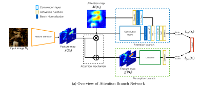
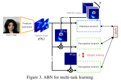
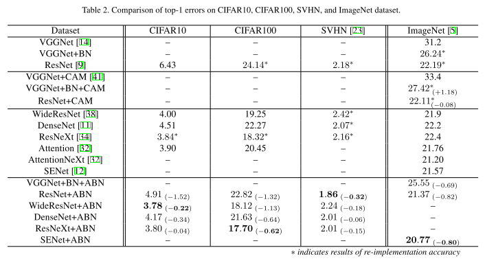
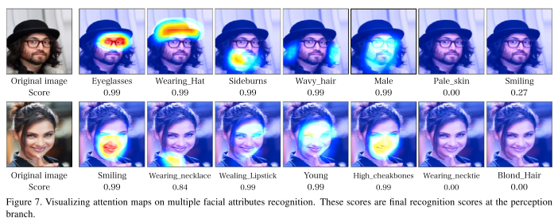

## Attention Branch Network: Learning of Attention Mechanism for Visual Explanation[[paper](http://openaccess.thecvf.com/content_CVPR_2019/html/Fukui_Attention_Branch_Network_Learning_of_Attention_Mechanism_for_Visual_Explanation_CVPR_2019_paper.html)][[code](https://github.com/machine-perception-robotics-group/attention_branch_network)]

### 概要
- 順伝播の過程で空間的なAttention Mapを生成し，説明性・精度の向上に貢献
- CAMで用いられたFC層の直前にGlobal Average Poolingを置くという制約が不要  
精度低下が起こらずむしろ改善する。
- Classification, Fine-grained recognition, Multi-task leariningにおいて良好なAttentionを獲得

### 手法
- CAMが一気通貫の構成であったのに対し，ABNはAttention BranchとPerception Branchを持つ
- Attention BranchはCAMと類似の機構を持たせ，Feature Mapと重みの線形和を1x1で代用してAttention Map(H x W x 1)を得る
- Perception BranchではPositionalなAttentionがかかったMapを入力とし，"通常の"ClassificationのNetworkを構成
- Multi-task learningではTaskごとのAttention Map(H x W x Task)を生成する
  

### 結果
- Classificationの精度はbaselineに対し改善した  
  
- ラベルに応じたAttentionを生成していることが確認できた
  

### 採択会議
CVPR2019

tag: deep learning, convolutional neural network, global average pooling, interpretability