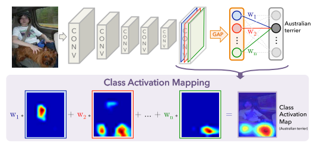
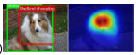
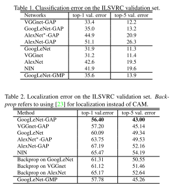
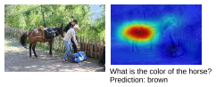

## CAM: Learning Deep Features for Discriminative Localization[[paper](http://cnnlocalization.csail.mit.edu/Zhou_Learning_Deep_Features_CVPR_2016_paper.pdf)][[code](https://github.com/metalbubble/CAM)]

### 概要
- global average poolingを用いたclassificationのnetworkが，  
image levelのtaskを解いているにも関わらずlocalizationを取得していることを主張した論文
- Class Activation Mapping(CAM)によるlocalized representationの可視化手法を提案
- 画像中にある説明性の高い部分を可視化する，という汎用的な手法なので，  
各種タスク(特にWeakly Supervised Learning)への応用を提示している
  - Discovering informative objects in the scenes
  - Concept localization in weakly labeled images
  - Weakly supervised text detector
  - Interpreting visual question answering

### 手法
- ClassificationのnetworkのFC層の手前にGlobal Average Pooling Layer（GAP)を挿入
- GAP前のFeature MapとFC層の重みの線形和をとりCAMを作成する
  - GAP前のFeature Mapは何かしらのパターンへの応答と考えられる
  - その応答がクラス推定にどれだけ寄与したかをFC層の重みを用いてみる
- CAMの値を閾値処理することでBBoxの生成も可能(Weakly Supervised Learningの問題設定)

### 結果
- Classificationの性能はやや落ちる
- LocalizationはBackPropを用いた手法よりも優れている  

- 抽象的なラベリングをされているデータからもdiscriminativeなlocalizationを得られている  

### 採択会議
CVPR2016

tag: deep learning, convolutional neural network, global average pooling, interpretability