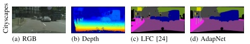
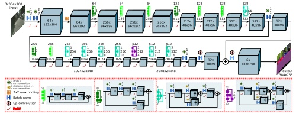
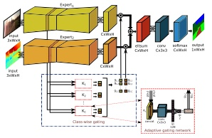
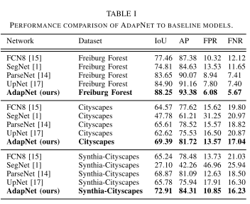
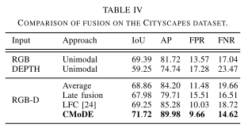

## AdapNet: Adaptive Semantic Segmentation in Adverse Environmental Conditions[[paper](http://ais.informatik.uni-freiburg.de/publications/papers/valada17icraa.pdf)][[tensorflow](https://github.com/DeepSceneSeg/AdapNet)]

### 概要
- 屋外でのロバストなSegmentationが目的  
Lightning, Seasons, Day等にロバストにしたい
- multi-modalな情報(RGB, Depthなど)を用いたconvoluted mixture of deep experts(CMoDE)モデルを提案  
状況に応じて適応的に各モーダルの重みを切り替える
- 様々な環境条件が含まれる3つのデータセットでSOTA

### 手法
- AdapNet architecture
  - ResNet50がベース
  - 7x7 convの前に3x3 convを入れてhigh-resolutionの特徴を取得
  - block4にはdilated convを導入し解像度の落ちを抑制
  - Multiscale Blocksの導入
    - BottleNeckの3x3 convを2つに分割し，異なるdilationのconvを適用
    - 異なるスケールの物体への活性化が期待できる

- Convoluted Mixture of Deep Experts
  - 各モーダルで個別に学習したモデルをエキスパートとする
  - backboneの中間層の情報を使って，各ネットワークのclass-wiseなAttentionを生成する  
  Gating Networkの学習はエキスパートの重みを固定した状態で行う

### 結果
- AdapNetの位置付け(RGB画像)  
  - 比較対象のネットワークより精度が高い
  - 自分より弱いのを持ってきた？  
  UpNetは著者陣の過去研究

- Fusion方法の比較結果
  - RGB + Dの組み合わせで比較
  - 単一のモーダルで構成するよりもマルチモーダルの方が精度が高いケースが多い
  - CMoDE(Fig) > LFC > Ave > Late fusionの位置付け
    - Aveはそれぞれのモーダルが出すlogitを平均する方法
    - Late fusionはAveの平均の前に1x1 convを入れる方法  
    この1x1がうまく学習されないからAveを下回る
    - LFCは各モーダルの特徴をconcatしてからconvで出力を出す

### 考察
- Multi-modal dataをDNNで扱う際の組み合わせ方の方法としてGatingを用いる構造は参考になる
- ただし各モーダルのネットワークがそれなりにリッチなので(RGB-DですらResNet50 x 2 + α)，更にモーダルが増えるとスケールしない
- マルチモーダルのもっと賢い組み合わせ方は考えても良いのでは？  
  - そこそこブルーオーシャン感もあるのでICRAあたりは狙えるかも
  - Dataset作成が課題か？
- [AdapNet++](https://github.com/DeepSceneSeg/AdapNet-pp)というupdate versionもある．  
  - cityscapesでも上位にランクイン(RGBのみでも)
  - 最新手法(DeeplavV3+など)と比較しても優位性あり
  - マルチモーダルのbenchmarkにふさわしいので実装しても良さそう

### 採択会議
ICRA2017

tag: deep learning, semantic segmentation, mixture-of-experts, robust