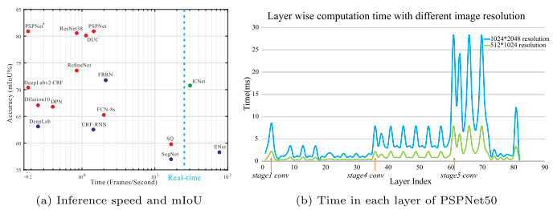
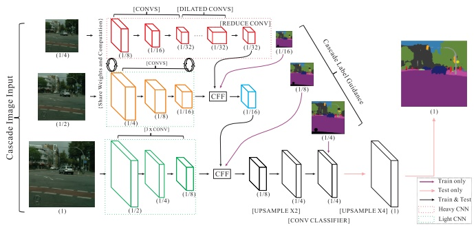
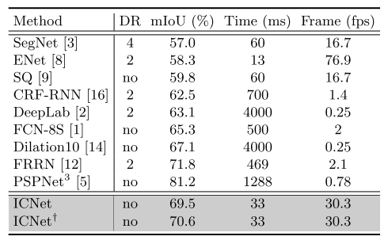

## ICNet for Real-Time Semantic Segmentation on High-Resolution Images[[paper](https://eccv2018.org/openaccess/content_ECCV_2018/papers/Hengshuang_Zhao_ICNet_for_Real-Time_ECCV_2018_paper.pdf)][[code](https://github.com/hszhao/ICNet)]

### 概要
- Semantic Segmentationを精度低下を抑えつつReal-Timeに実行するネットワークの提案
- 入力画像($2048 \times 1024$ pixels)を3つのスケールにリサイズし，それぞれの解像度に異なる特徴抽出を担わせる構造
- ECCV2018時点で速度と精度のバランスが良いネットワークを構築(Cityscapes)

### 手法

- ResNet50の計算時間が長い部分を効率化する
  - output_stride=8の場合は，block3,4の計算時間が非常に長い
  - このような深い層で得られるHigh-Levelな特徴は，解像度が多少落ちても取得できるというアイデア
- 入力画像を3つの解像度にリスケールし，それぞれの解像度に異なる役割を持たせる
  - もっとも解像度の低い入力(1/4)はResNetをFullに通しContextを抽出させる
  - 中間解像度，オリジナル解像度の入力は出力のRefineのために使いConvの数を減らす  
    - 中間解像度(1/16)はResNetの3 block目までを通す(Weightは最低解像度のNetworkとShare)
    - オリジナル解像度は数個のConvのみ
- Cascade Feature Fusion
  - 低解像度の特徴と高解像度の特徴をFusionするModule
  - 低解像特徴はBilinear upsample --> Dilated Convで高解像特徴と次元が揃えられる
- Cascade Label Guidancd  
通常の等倍スケールでの出力に対するLossに加えて，それぞれのスケールから出るClassificationの結果(1/16, 1/8, 1/4の解像度)にもLossを与える 

### 結果
- 速度・精度のベンチマークとして，PSPNet50に対し3種類の高速化手法をトライ
  - 入力解像度を落としたもの(1, 1/2, 1/4)
  - Output_strideを変化させたもの（32, 16, 8)
  - モデル圧縮(寄与の低いカーネルの枝狩り)
- これらのベンチマークよりもICNetは精度と速度のバランスが良い
- Cityscapes($2048 \times 1024$ pixels)で30fps, mIoU~70%を達成  
GPUはTitan X

### 採択会議
ECCV2018

tag: deep learning, convolutional neural network, semantic segmentation, real-time