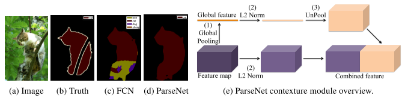
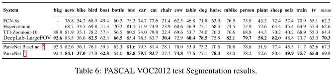

## PARSENET:LOKKING WIDER TO SEE BETTER[[paper](https://openreview.net/pdf?id=Qn8x8rGr5CkB2l8pUY8P)][[code](https://github.com/weiliu89/caffe/tree/fcn)]

### 概要
- GlobalなContextも考慮してSemantic Segmentationを行う手法の提案
- Global Average Poolingを用いたGlobal Contextの取得，L2 Normalizationによる学習の安定化に貢献
- Receptive Fieldを広げることに成功し，Contextを強く反映した分類が可能となった(複数のラベルが混ざる現象の抑制)

### 手法
- 理論上のReceptive Filedに対し，実際のReceptive Filedは狭い  
著者らは入力の特定のWindow内にノイズを加えた際の注目pixelの値の変動を見て，Emprical Receptive Filedを見ている
- Global Average Poolin(GAP)によるGlobal Contextの取得
  - 実Receptive Filedを広げるための手法
  - Backboneの出力である特徴(Local Feature)とGAPのFeatureをConcatしてheadへ渡す
    - これをEarly Fusionという
    - 別の方法でLate Fusionという手法もある  
    こちらは複数の特徴から出力をそれぞれ推定し，それらを合算するという方法(Late)
    - Early Fusionの方が現在は主流だと思う
- L2 Normalization
  - Batch Normalizationの平均値シフトとbiasの追加がないVersionと考えて良い
  - 各LayerでのActivationの値が大きく異なる場合，学習が安定しない  
  Parameter Tunningが必要になってしまう
  - L2 Normalizationでスケールを調整することで学習が安定する

### 結果
- SiftFLow datasetではGlobal Contextの効果はほとんどなし  
  - VGGの最終層のReceptive Fieldでほぼ画像全体をカバーできているため
  - むしろ，中間層の特徴を活用する方が効果的
- Pascal ContextではGlobal Feature, 中間特徴双方のメリットあり  
ただし結合前にL2 Normalizationをしないと恩恵は受けられない
- Pascal VOCでもGlobal Contextは効果的  
  - ちなみにspatial pyramid poolingも試したとある  
    - PSPNetの先取り
    - Advantageはなかったとのこと  
    PSPはADE20Kのような複雑な問題にはSPPが必要と論じていた。Pascal VOCは簡単？

### 採択会議
ICLR2016

tag: deep learning, convolutional neural network, semantic segmentation, context, scene parsing